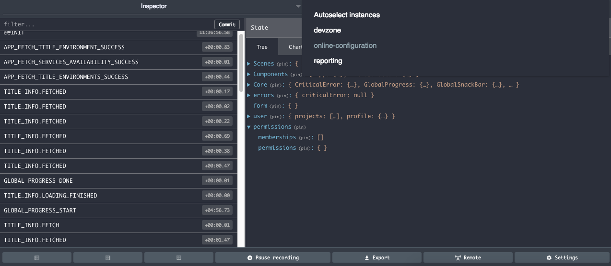

## Basic Rules

In order to make it easier for everyone to read our codebase, we follow the style guide written by AirBnb (except for the formatting, where we use [prettier](https://prettier.io/)). Please read the two following pages before starting anything:

- [Javascript Style Guide](https://github.com/airbnb/javascript)
- [React Style Guide](https://github.com/airbnb/javascript)

## Custom Rules

The following rules overwrittes the one from AirBnb:

- Don't think about formatting code at all. We use [prettier](https://prettier.io/) for that.
- Never use `.jsx` file extension. See [gaeron's comment](https://github.com/facebook/create-react-app/issues/87#issuecomment-234627904)
- Always use function declarations or arrow functions.

```js
// bad
const foo = function() {
  // ...
};

// bad
const short = function longUniqueMoreDescriptiveLexicalFoo() {
  // ...
};

// good
function foo() {
  // ...
}

// good
const foo = () => {
  // ...
};
```

- [10.3 And do not export directly from an import.](https://github.com/airbnb/javascript#modules--no-export-from-import): we allow use of `export`.
- [10.6 In modules with a single export, prefer default export over named export](https://github.com/airbnb/javascript#modules--prefer-default-export): this don't apply to helpers module, since a new helper module generally start with only one function and grow with time.
- [11.2 Don’t use generators for now](https://github.com/airbnb/javascript#generators--nope): we allow generators for **sagas only**.

## Toolings

We use a lot of automatic tools to help us be more productive, like prettier and eslint. They all come with really good editor extensions (whatever you use, there should be an extension for it!).

We also have some git hooks to help us:

- automatically format staged files using prettier
- _more to come soon_

We encourage you to use the [React Devtools](https://github.com/facebook/react-devtools) and [Redux Devtools](https://github.com/zalmoxisus/redux-devtools-extension) browser extensions (works with Firefox and Chrome).

Redux Devtools is even enabled on our QA and production servers for easier live debugging! Actions are only recorded if the tool is open, so make sure to open it first and then reload the page.

_Tips: the Redux Devtools allow you to switch between multiple redux stores! (selector in the top-right corner)_


