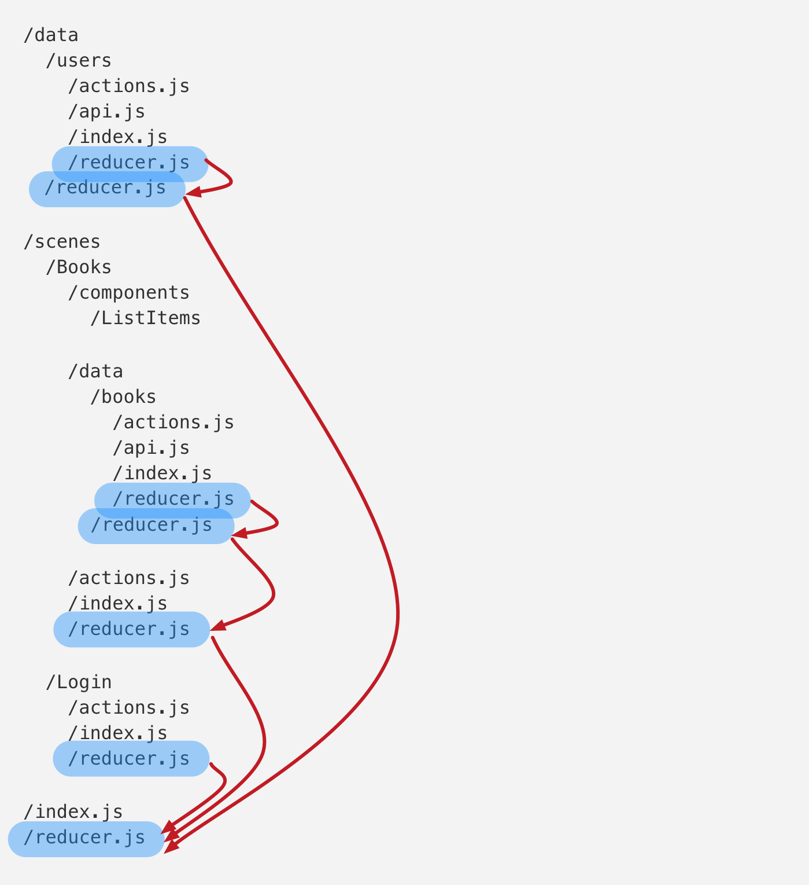

## Components

We want to separate our components in two types, container and presentational. Take a look to these articles to read more about it:

- https://medium.com/@dan_abramov/smart-and-dumb-components-7ca2f9a7c7d0
- https://github.com/krasimir/react-in-patterns/tree/master/patterns/presentational-and-container
- https://medium.com/@learnreact/container-components-c0e67432e005
- https://hackernoon.com/react-stateless-functional-components-nine-wins-you-might-have-overlooked-997b0d933dbc

Summarizing:

Presentational

- Are concerned with how things look.
- May contain both presentational and container components inside, and usually have some DOM markup and styles of their own.
- Often allow containment via `this.props.children`.
- Have no dependencies on the rest of the app, such as Flux actions or stores.
- Don’t specify how the data is loaded or mutated.
- Receive data and callbacks exclusively via props.
- Rarely have their own state (when they do, it’s UI state rather than data).
- Are written as functional components unless they need state, lifecycle hooks, or performance optimizations.

Container

- Are concerned with how things work.
- May contain both presentational and container components inside but usually don’t have any DOM markup of their own except for some wrapping divs, and never have any styles
- Provide the data and behavior to presentational or other container components.
- Call Flux actions and provide these as callbacks to the presentational components.
- Are often stateful, as they tend to serve as data sources.
- Are usually generated using higher order components such as connect() from React Redux, rather than written by hand.

## Structure of our components - COMPLETE EXAMPLE

First of all we are gonna define our case scenario. Imagine that we will have a new whole feature in our application to show all the relevant information about our contacts. For that we will create a new `scene` that encapsulates all the components needed for the contacts feature, like this:

- `{unitName}/`
  - `scenes/`
    - `Contacts/`

`Contacts` will be the folder of our main container, and will contain the following files:

- `scenes/`
  - `Contacts/`
    - `components/`: we will store all the sub components in there. Only the components that are gonna be used exclusively by `Contacts`. If any other `scene` can use any of these components, the component in question should be added in `{unitName}/components` instead.
    - `actions.js`: it will contain all the Redux action creators.
    - `actionTypes.js`: it will contain the constants related with the action type names.
    - `container.js`: it will contain the container component.
    - `index.js`: the access point to this component. From any other component `Contacts` will be imported like this: `import Contacts from '[any relative route]/Contacts'`.
    - `presentational.js`: it will contain the presentational component.
    - `presentational.css`: it will contain the scss code related with the presentational component.
    - `reducer.js`: the component reducer.
    - `selectors.js`: in this file we will include any selector if is necessary. https://github.com/reactjs/reselect
    - `saga.js`: it will contain all the API calls if are necessary. https://redux-saga.js.org/
    - `__tests__`: contains tests in separate files, like `container.test.js` and `selectors.test.js`
    - `__helpers__`: contains helpers for tests

So imagine now that we want to show a list of contacts, and for each contact we want to show the name and the email. For that we will need two stateless components `Contact` and `ContactList`. I said stateless because in this scenario we will get our data from the server in the parent component `Contacts`, so we don't need any API call in our components `Contact` and `ContactList`. So let's start with `Contact` component.

We will create a new folder under `Contacts/components`, because `Contact` only will be used under `Contacts` component.

- `scenes/`
  - `Contacts/`
    - `components/`
      - `Contact/`

and it will have the following files.

- `Contact/`
  - `index.js`: stateless react component
  - `index.css`: css styles for the stateless component

Let's see what our `index.js` file looks like:

```js
import React from 'react';
import PropTypes from 'prop-types';

const Contact = ({ name, email }) => (
  <div className="Contact__main-container">
    Contact name: {name} Contact email: {email}.
  </div>
);

Contact.propTypes = {
  name: PropTypes.string.isRequired,
  email: PropTypes.string.isRequired,
};

export default Contact;
```

_Tips: To learn more about [PropTypes, read this](https://reactjs.org/docs/typechecking-with-proptypes.html)._

Now we will create another stateless component called `ContactList` like this.

We will create a new folder under `Contacts/components`, because `ContactList` only will be used under `Contacts` component.

- `scenes/`
  - `Contacts/`
    - `components/`
      - `ContactList/`

and it will have the following files.

- `ContactList/`
  - `index.js`: stateless react component
  - `index.css`: css styles for the stateless component

Let's see what our `index.js` file looks like:

```js
import React from 'react';
import PropTypes from 'prop-types';

import Contact from '../Contact';

const ContactList = ({ contacts }) => {
  const listOfContacts = contacts.map(c => <Contact key={c.id} {...c} />);

  /**
   * We also could create the contact passing all the props one by one:
   * <Contact key={c.id} name={c.name} email={c.email} />
   *
   * This way is better when the object props.contacs has a lot of properties and we only want to use `name` and `email`.
   */

  return <div className="ContactList__main-container">{listOfContacts}</div>;
};

ContactList.propTypes = {
  contacts: PropTypes.array.isRequired,
};

export default ContactList;
```

So now we have our stateless components created and our tree structure looks like this:

- `scenes/`
  - `Contacts/`
    - `components/`
      - `Contact/`
        - `index.js`
        - `index.css`
      - `ContactList/`
        - `index.js`
        - `index.css`
    - `actions.js`
    - `actionTypes.js`
    - `container.js`
    - `index.js`
    - `presentational.jsx`
    - `presentational.css`
    - `reducer.js`
    - `selectors.js`
    - `saga.js`

Now we have to create our main stateless component, `scenes/Contacts/presentational.jsx` looks like this:

```js
import React from 'react';
import PropTypes from 'prop-types';

import ContactList from './components/ContactList';

const StatelessContacts = ({ title, contacts }) => (
  <div className="Contact__main-container">
    <h1>{title}</h1>
    <ContactList contacts={contacts} />
  </div>
);

StatelessContacts.propTypes = {
  title: PropTypes.string.isRequired,
  contacts: PropTypes.array.isRequired,
};

export default StatelessContacts;
```

That's all we need in our `presentational` component.

Before we write our `container` component let's create our API call to have something to show.

Create a separate folder called `services` to store all our API calls.

- `{unitName/`
  - `scenes/`
  - `services/`

So under `services` folder we will create a file for the contacts API calls:

- `services/`
  - `contacts.js`

And `contacts.js` will look like:

```js
import axios from 'axios';

const backendHost = 'http://localhost:3000'; // our backend host

/**
 * Will returns an object like this:
 * { contacts: [{ name: "...", email: "..." }, ... ] }
 */
export const fetchContacts = () => axios.get(`${backendHost}/contacts`);
```

Now we have our API call done, let's create a `saga` that uses it. But first we have to create a Redux action because the `saga` will use it. So go again to our `Contacts` main component.

- `scenes/`
  - `Contacts/`

Edit the file `actionTypes.js` and add the following code:

```js
export const CONTACTS_FETCH = 'CONTACTS_FETCH';
export const CONTACTS_FETCH_SUCCESS = 'CONTACTS_FETCH_SUCCESS';
export const CONTACTS_FETCH_FAILED = 'CONTACTS_FETCH_FAILED';
```

Then edit the file `actions.js` with the following action creators:

```js
import * as AT from './actionTypes';

export const fetchContacts = () => ({ type: AT.CONTACTS_FETCH });

export const fetchContactsSucceed = contacts => ({
  type: AT.CONTACTS_FETCH_SUCCESS,
  contacts,
});

export const fetchContactsFailed = error => ({
  type: AT.CONTACTS_FETCH_FAILED,
  message: error.message,
});
```

Now we can edit the file `saga.js` without any problem.

```js
import { call, put, takeLatest } from 'redux-saga/effects';

import { fetchContacts as API_fetchContacts } from 'services/contacts';
import * as Actions from './actions';
import { CONTACTS_FETCH } from './actionTypes';

function* fetchContacts(action) {
  try {
    const { data } = yield call(API_fetchContacts);
    yield put(Actions.fetchContactsSucceed(data));
  } catch (e) {
    yield put(Actions.fetchContactsFailed(e));
  }
}

function* saga() {
  // Only allow one fetch at a time. If another fetch is dispatched, the current one is cancelled.
  yield takeLatest(CONTACTS_FETCH, fetchContacts);
}

export default saga;
```

We are almost done. Let's create our logic layer that includes our `Container` component and the `Reducer`, let's start with the `reducer.js` file:

```js
import * as AT from './actionTypes';

// Here we define the initial state of our reducer, an empty collection of contacts.
const INITIAL_STATE = {
  contacts: [],
};

export default function reducer(state = INITIAL_STATE, action) {
  switch (action.type) {
    case AT.CONTACTS_FETCH_SUCCEED:
      return {
        ...state,
        contacts: action.contacts,
      };
    default:
      return state;
  }
}
```

And now we are gonna create our `Container` editing our file `/Contacts/container.js`:

```js
import React, { Component } from 'react';
import { connect } from 'react-redux';

import StatelessContacts from './presentational';
import * as Actions from './actions';

const stateToProps = (state, props) => ({
  // A good thing about our App structure is that we have the same structure in our Redux state.
  contacts: state.Scenes.Contacts.contacts,
});

const dispatchToProps = {
  // It will dispatch our `fetchContacts` action everytime we call `loadContacts`.
  loadContacts: Actions.fetchContacts,
};

class Contacts extends Component {
  componentDidMount() {
    this.props.loadContacts();
  }

  render() {
    return <StatelessContacts {...this.props} />;
  }
}

Contacts.propTypes = StatelessContacts.propTypes;

export default connect(
  stateToProps,
  dispatchToProps
)(Contacts);
```

Now we have our `Contacts` main component completed, assuming we have all our styles and tests in place. :)

The last thing that we have to do to expose it to the rest of the app is edit our `Contacts/index.js` adding this two lines of code:

```js
/**
 * Here we could also expose any other part of our component, like:
 * - actions types
 * - actions
 * - reducer
 * - middleware
 * - saga
 */
import Contacts from './container';

export default Contacts;
```

Now we have completely finished all our components, lets join our `reducer` and `saga` to their parents. Following the pattern from this article https://medium.com/@alexmngn/how-to-use-redux-on-highly-scalable-javascript-applications-4e4b8cb5ef38



In our App, we will have a parent reducer and a parent saga in the parent folder, like this:

- `scenes/`
  - `Contacts/`
  - `reducer.js`
  - `sagas.js`

We will join the `reducer` and the `saga` from `Contacts` component to them, like this:

- `scenes/reducer.js`

```js
import { combineReducers } from 'redux';
import contactsReducer from './Contacts/reducer';

const reducer = combineReducers({
  Contacts: contactsReducer,
  // Other reducers here'
});

export default reducer;
```

- `scenes/sagas.js`

```js
import contactsSaga from './Contacts/saga';

const sagas = [
  contactsSaga,
  // Other sagas here...
];

export default sagas;
```

Then in our `store` (`{unitName}/store.js`), we use our `scenes/reducer.js` and `scenes/sagas.js` to wire everything up.

The last thing that we have to do is to use our component in a `Route`:

```js
// using AsyncComponent we import our new Contacts main component
const AsyncContacts = AsyncComponent(() => import('./scenes/Contacts'));

// And we create a route with it
<Route path="/contacts" component={AsyncContacts} />;
```
